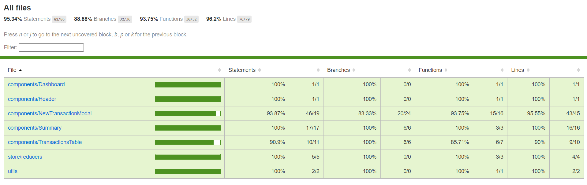

# my-money
A simple personal finance control built with React and Redux.


## Running Locally

```sh
yarn install

# start the app on a new terminal window
yarn start
```

Open [http://localhost:3000](http://localhost:3000) to view it in the browser.

## Running automated tests

```sh
yarn test:coverage
```

Open the html file ./coverage/lcov-report/index.html after running the command test:coverage to view the coverage report in the browser.



